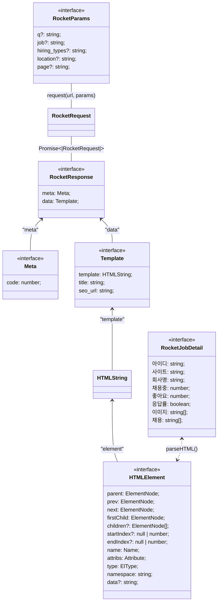

# 로켓펀치 구인공고 크롤링

Languages: TypeScript
Tags: Developer job

## 데이터 모델 구조

## 결과물 테이블 (csv or db)

[로켓펀치](https://github.com/AndrewDongminYoo/Serverless-Framework-Crawlers/blob/main/doc/크롤링%20스크래핑%20자동화테스트/완료된%20크롤링%20프로젝트/로켓펀치%20구인공고%20크롤링/로켓펀치.csv)
