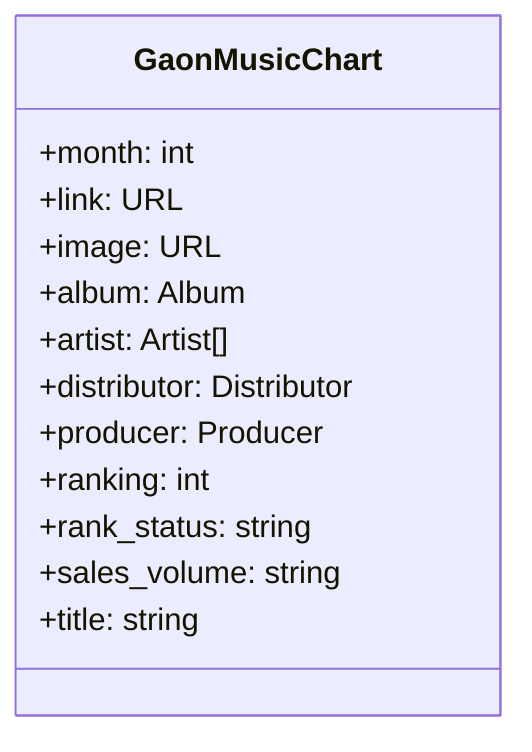

# 가온 앨범차트

Languages: Python
Tags: Music Chart

## 데이터 모델 구조



## 깃허브 코드 (gist)

[Serverless-Framework-Crawlers/api.py](https://github.com/AndrewDongminYoo/Serverless-Framework-Crawlers/blob/main/circle-chart/api.py)

```python
import logging
import requests
import json
from datetime import datetime
from common import as_chart_array
from utils import (
    date_to_string,
    set_queries,
    object_to_list,
    roll,
)
from driver import USER_AGENT

TODAY = datetime.today()
TERM = 30
MONTH = 'month'
CIRCLE_URL = 'https://circlechart.kr'
logger = logging.getLogger(__name__)
logger.setLevel(logging.INFO)
logger.info(f"requests module version: {requests.__version__}")

def fetch_chart_api(period: str, chart_type: str, dt: datetime):
    try:
        queries = {'termGbn': period}
        yyyymm = date_to_string(dt, period)
        if chart_type == "global":
            queries['yyyymmdd'] = yyyymm
        elif chart_type == "album":
            queries['hitYear'] = date_to_string(dt, 'year')
            queries['targetTime'] = date_to_string(dt, 'M')
            queries['nationGbn'] = 'T'
            queries['yearTime'] = '3'
            queries['curUrl'] = f'{CIRCLE_URL}/page_chart/{chart_type}.circle{set_queries(queries)}'
        url = f'{CIRCLE_URL}/data/api/chart/{chart_type}{set_queries(queries)}'
        headers = requests.utils.default_headers()
        headers["User-Agent"] = USER_AGENT
        headers['Accept'] = 'application/json, text/javascript, */*; q=0.01'
        headers['Accept-Language'] = 'ko-KR,ko;q=0.9,en-US;q=0.8,en;q=0.7'
        headers['Sec-Fetch-Dest'] = 'empty'
        headers['Sec-Fetch-Mode'] = 'cors'
        headers['Sec-Fetch-Site'] = 'same-origin'
        headers['X-Requested-With'] = 'XMLHttpRequest'
        headers['sec-ch-ua'] = '"Chromium";v="106", "Google Chrome";v="106", "Not;A=Brand";v="99"'
        headers['Referrer'] = f'{CIRCLE_URL}/page_chart/{chart_type}.circle'
        req = requests.Request('POST', url)
        request = req.prepare()
        request.prepare_headers(headers=headers)
        res = requests.Session().send(request=request)
        result = res.json()
        if result["ResultStatus"] == "OK":
            return as_chart_array(object_to_list(result["List"]), yyyymm, url)
        else:
            return {
                "status_code": res.status_code,
                "url": res.url,
                "content": json.loads(res.content),
                "encoding": res.encoding,
                "reason": res.reason
            }
    except Exception as e:
        logger.exception(e)
        raise e

def fetch_api_data(mode: str):
    if mode == "w":
        roll(TODAY, fetch_chart_api, "global", TERM, MONTH, 10)
        roll(TODAY, fetch_chart_api, "album", TERM, MONTH, 130)
    else:
        roll(TODAY, fetch_chart_api, "global", TERM, MONTH, 1)
        roll(TODAY, fetch_chart_api, "album", TERM, MONTH, 1)

if __name__ == '__main__':
    fetch_api_data("w")
```

---

## 결과물 테이블 (csv or db)

### Global K-pop Chart February 24, 2023 Days

일간 차트 : 글로벌 음악서비스 플랫폼의 일간 사용량 업데이트 시간에 따라 변동 가능

> Daily Chart : Contents may change, depending on the time at which global music service platforms update their daily figures.

순위집계 : 전세계 K-pop 스트리밍 사용량에 따라 집계

> Ranking System : Worldwide K-pop streaming usage

new : 차트에 새롭게 진입한 곡(앨범) | HOT : 100위 이상 순위 상승한 곡(앨범)

> new : Newly entered | HOT : Jumped up over 100 ranks

[global_chart.csv](https://github.com/AndrewDongminYoo/Serverless-Framework-Crawlers/blob/main/docs/크롤링%20스크래핑%20자동화테스트/완료된%20크롤링%20프로젝트/가온%20앨범차트/global_chart%20csv.csv)

[CIRCLE CHART - 써클차트](https://circlechart.kr/page_chart/global.circle?termGbn=day)

순위집계 : 앨범(TAPE, LP, CD, USB, KiT, Platform Album 등) 출하량(-반품량)으로 집계

> Ranking System : Album distribution volume (Shipments – Returns). (TAPE, LP, CD, USB, KiT, Platform Album, etc.)

new : 차트에 새롭게 진입한 곡 앨범 | HOT : 100위 이상 순위 상승한 앨범

> new : Newly entered | HOT : Jumped up over 100 ranks

[albums_chart.csv](https://github.com/AndrewDongminYoo/Serverless-Framework-Crawlers/blob/main/docs/크롤링%20스크래핑%20자동화테스트/완료된%20크롤링%20프로젝트/가온%20앨범차트/global_chart%20csv.csv)

[CIRCLE CHART - 써클차트](https://circlechart.kr/page_chart/album.circle)

---
