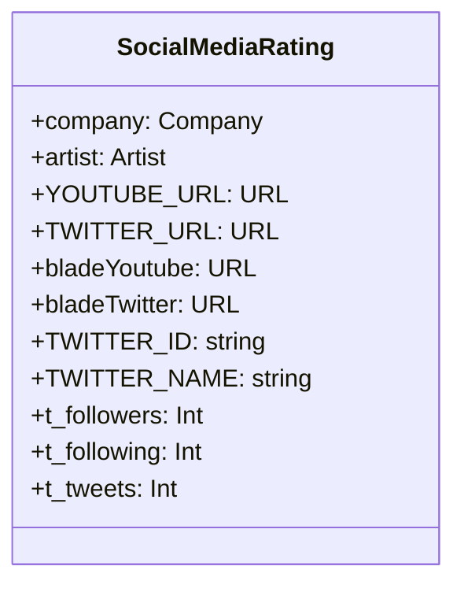

# 소셜네트워크 인덱스

Languages: Python
Tags: SNS

## 데이터 모델 구조



## 깃허브 코드 (git)

---

[Serverless-Framework-Crawlers/youtube.py](https://github.com/AndrewDongminYoo/Serverless-Framework-Crawlers/blob/main/social-count/youtube.py)

- [youtube.py](https://github.com/AndrewDongminYoo/Serverless-Framework-Crawlers/blob/main/social-count/youtube.py)

  ```python
  from googleapiclient.discovery import build
  from googleapiclient.errors import HttpError
  import argparse
  from dotenv import load_dotenv
  import os

  load_dotenv()
  DEVELOPER_KEY = os.environ["YOUTUBE_API_KEY"]
  YOUTUBE_API_SERVICE_NAME = "youtube"
  YOUTUBE_API_VERSION = "v3"

  def get_youtube_response(options, api_type):
      youtube = build(
          YOUTUBE_API_SERVICE_NAME,
          YOUTUBE_API_VERSION,
          developerKey=DEVELOPER_KEY
      )
      if api_type == "search":
          return youtube.search().list(
              q=options.q,
              part="id,snippet",
              maxResults=options.max_results
          ).execute()
      elif api_type == "channels":
          return youtube.channels().list(
              id=options.id,
              part="statistics",
              maxResults=options.max_results
          ).execute()

  def search_all(options):
      search_response = get_youtube_response(options, "search")
      videos = []
      channels = []
      playlists = []
      for search_result in search_response.get("items", []):
          if search_result["id"]["kind"] == "youtube#video":
              videos.append(f"{search_result['snippet']['title']} ({search_result['id']['videoId']}) : (채널명 {search_result['snippet']['channelTitle']})")
          elif search_result["id"]["kind"] == "youtube#channel":
              channels.append(f"{search_result['snippet']['title']} ({search_result['id']['channelId']}) : (채널명 {search_result['snippet']['channelTitle']})")
          elif search_result["id"]["kind"] == "youtube#playlist":
              playlists.append(f"{search_result['snippet']['title']} ({search_result['id']['playlistId']}) : (채널명 {search_result['snippet']['channelTitle']})")
      return dict(videos=videos, channels=channels, playlists=playlists)

  def get_channel_id(options):
      search_response = get_youtube_response(options, "search")
      for search_result in search_response.get("items", []):
          if search_result["id"]["kind"] == "youtube#channel":
              if search_result["snippet"]["title"] == options.q:
                  return search_result["snippet"]["channelId"]

  def youtube_search(options):
      search_response = get_youtube_response(options, "channels")
      for search_result in search_response.get("items", []):
          if search_result["kind"] == "youtube#channel":
              if search_result["id"] == options.id:
                  return search_result["statistics"]

  def youtube_query(query, service):
      arg_parser = argparse.ArgumentParser(description="create argument namespace")
      arg_parser.add_argument("--max-results", help="Max results", default=100)
      arg_parser.add_argument("--id", help="Channel Id", default=query)
      arg_parser.add_argument("--q", help="Search term", default=query)
      args = arg_parser.parse_args()
      try:
          if service == "list-channels":
              return youtube_search(args)
          elif service == "channel-id":
              return get_channel_id(args)
          elif service == "search-all":
              return search_all(args)
      except HttpError as e:
          print("An HTTP error %d occurred:\n%s" % (e.resp.status, e.content))
  ```

[Serverless-Framework-Crawlers/twitter.py](https://github.com/AndrewDongminYoo/Serverless-Framework-Crawlers/blob/main/social-count/twitter.py)

- [twitter.py](https://github.com/AndrewDongminYoo/Serverless-Framework-Crawlers/blob/main/social-count/twitter.py)

  ```python
  import requests
  import os
  from urllib.parse import quote
  from dotenv import load_dotenv

  load_dotenv()
  bearer_token = os.environ.get("TWITTER_BEARER_TOKEN")

  def create_url(query: str, service: str):
      if service == "get-user-id":
          path = f"by/username/{quote(query)}"
      if service == "user":
          path = f"by/?usernames=TwitterDev,TwitterAPI&user.fields=description,created_at"
      elif service == "followers":
          path = f"{query}?user.fields=public_metrics"
      url = f"https://api.twitter.com/2/users/{path}"
      return url

  def bearer_oauth(r):
      """
      Method required by bearer token authentication.
      """
      r.headers["Authorization"] = f"Bearer {bearer_token}"
      r.headers["User-Agent"] = "v2UserLookupPython"
      return r

  def connect_to_endpoint(url):
      response = requests.request("GET", url, auth=bearer_oauth)
      if response.status_code != 200:
          raise Exception(
              "Request returned an error: {} {}".format(
                  response.status_code, response.text
              )
          )
      return response.json()

  def change_to_id(twitter_name):
      url = create_url(twitter_name, "get-user-id")
      json_response = connect_to_endpoint(url)
      try:
          return json_response["data"]["id"]
      except KeyError:
          print(json_response)
      except TypeError:
          print(json_response)

  def get_public_metrics(twitter_id):
      url = create_url(twitter_id, "followers")
      json_response = connect_to_endpoint(url)
      try:
          return json_response["data"]["public_metrics"]
      except KeyError:
          print(json_response)
      except TypeError:
          print(json_response)
  ```

## 결과물 테이블 (csv or db)

---

[entertainment.csv](https://github.com/AndrewDongminYoo/Serverless-Framework-Crawlers/blob/main/docs/크롤링%20스크래핑%20자동화테스트/완료된%20크롤링%20프로젝트/소셜네트워크%20인덱스/entertainment%20csv.csv)

[twitter_221104.csv](https://github.com/AndrewDongminYoo/Serverless-Framework-Crawlers/blob/main/docs/크롤링%20스크래핑%20자동화테스트/완료된%20크롤링%20프로젝트/소셜네트워크%20인덱스/twitter_221104%20csv.csv)
