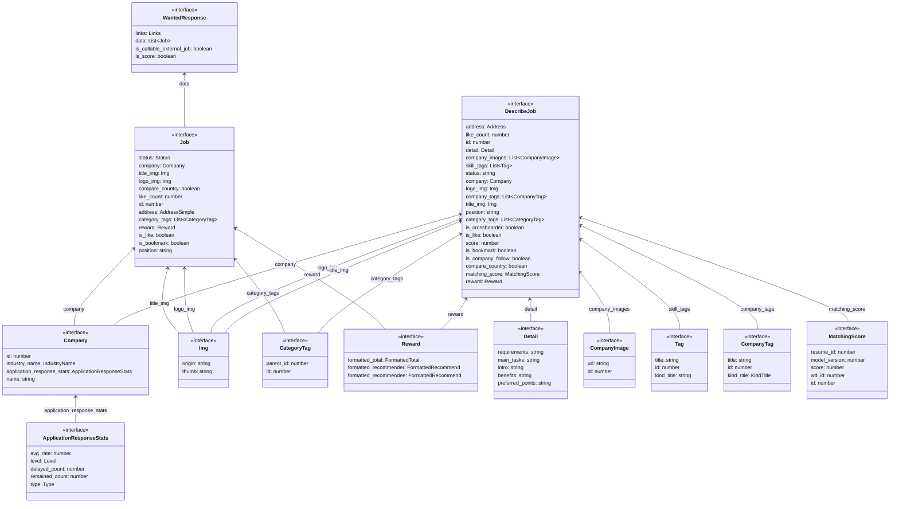

# 원티드 구인공고 크롤링

Languages: TypeScript
Tags: Developer job

## 데이터 모델 구조

## 깃허브 코드 (gist)

`?:` 삼항식 타입을 사용해 `AxiosResponse` 의 `data` 값을 미리 단언하는 코드

[Serverless-Framework-Crawlers/response.types.ts](https://github.com/AndrewDongminYoo/Serverless-Framework-Crawlers/blob/main/dev-jobs-cron/types/response.types.ts#L28)

`infer` 키워드를 사용해 유틸리티 타입을 구현한 `ArrayElement<T>` 커스텀 타입

[Serverless-Framework-Crawlers/notion.types.ts](https://github.com/AndrewDongminYoo/Serverless-Framework-Crawlers/blob/main/dev-jobs-cron/types/notion.types.ts#L106)

## 결과물 테이블 (csv or db)

[원티드](https://github.com/AndrewDongminYoo/Serverless-Framework-Crawlers/blob/main/docs/크롤링%20스크래핑%20자동화테스트/완료된%20크롤링%20프로젝트/원티드%20구인공고%20크롤링/원티드.csv)
